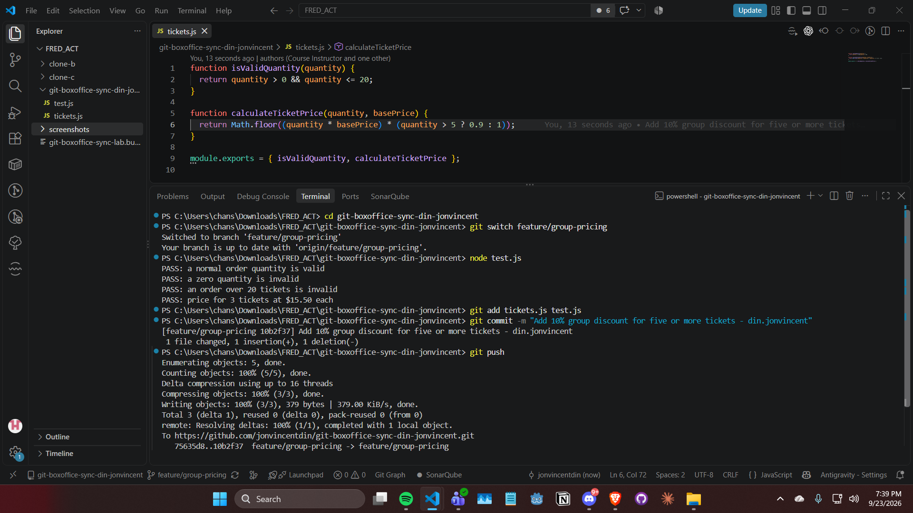
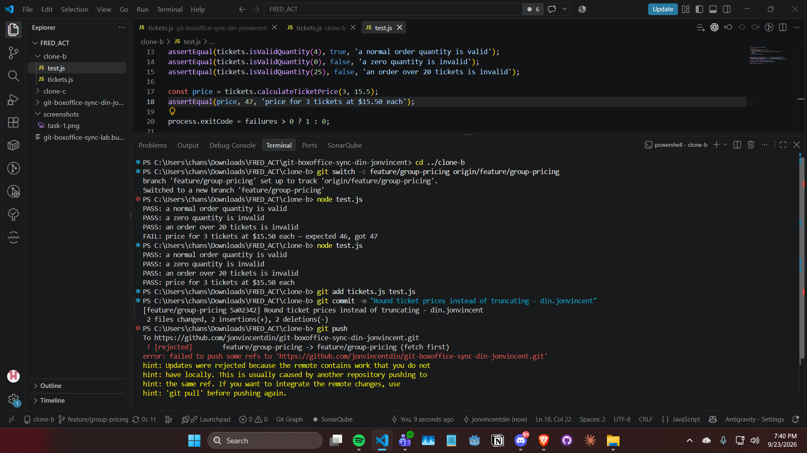
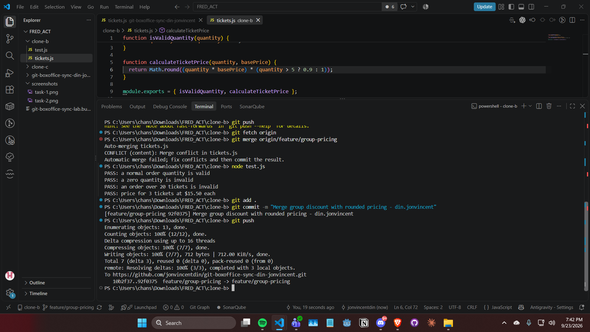
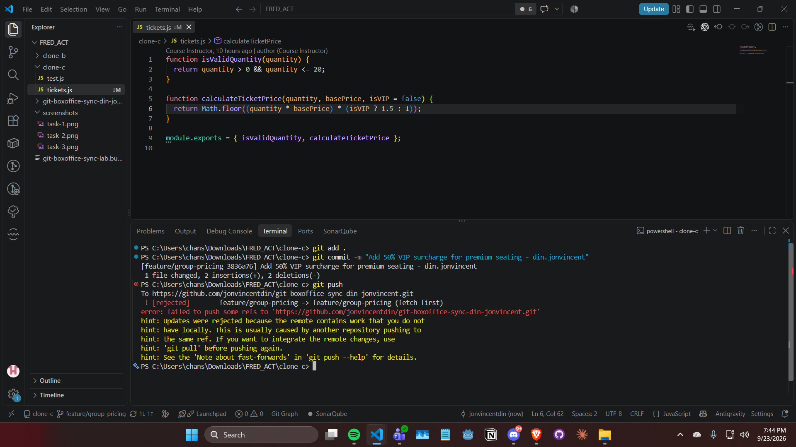
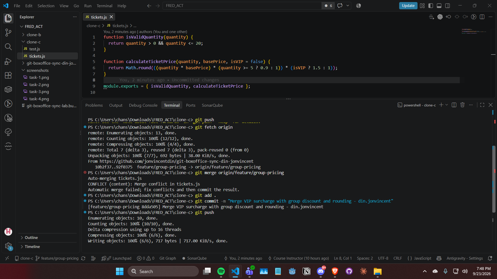
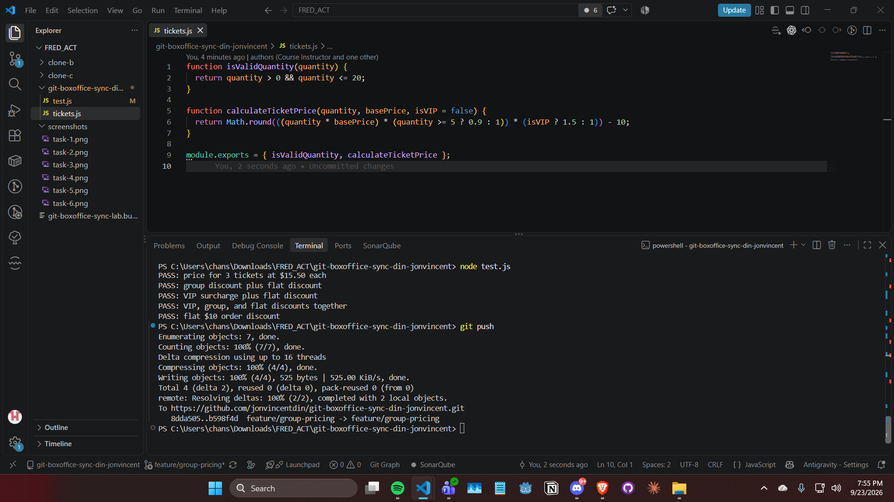
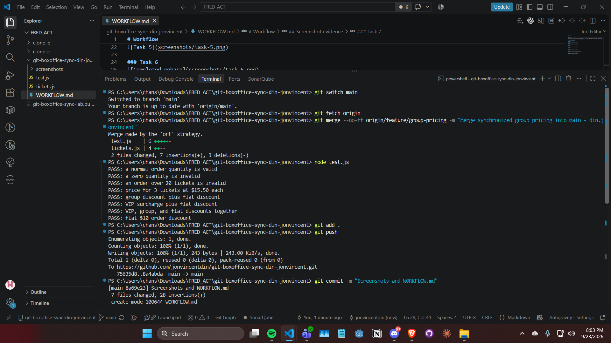

# Workflow

## If this were a real team of three, what one process change would have prevented all three rejected pushes?
### Answer:
Require every contributor to fetch and integrate the latest feature/group-pricing branch before pushing. Each rejected push happened because a contributor tried to push work based on an outdated branch.

## Screenshot evidence

### Task 1

### Task 2

### Task 3

### Task 4

### Task 5

### Task 6

### Task 7

